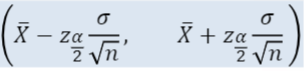
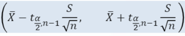
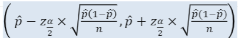
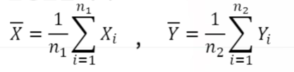
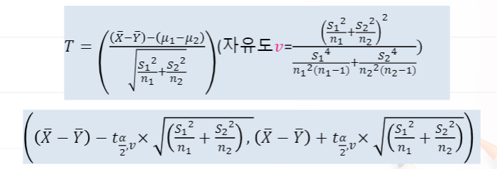
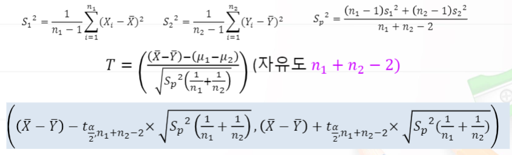
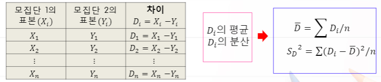
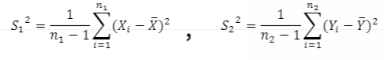
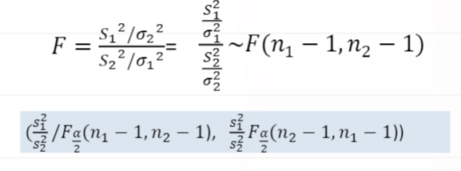
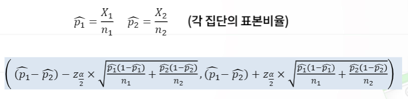

# 5. 기초통계분석과 R실습

# 5-2. 신뢰구간 추정의 이해

## 통계 이론 기초

- 모수(parameter)와 통계량(estimatior)
  - 모수 : 모집단의 특성을 나타내는 값 (ex. 모평균, 모분산, 모비율) -> 고정되어 있는 상수.
  - 통계량 : 표본의 특성을 나타내는 값 (ex. 표본평균, 표본분산, 표본비율) -> 샘플에 따라서 변동이 될 수 있는 random variable. 즉, 확률변수로 생각 할 수 있음.
- 통계량의 표본분포(Sampling distribution)
  - 표본분포란 모집단에서 일정한 크기의 모든 가능한 표분을 추출하였을 때 그 모든 표본으로부터 계산된 통계량의 확률분포를 의미.

- 중심극한정리(Central Limit Theorem)
  - 평균이 μ와 σ^2인 모집단으로부터 n개의 랜덤표본 X1,X2, ..., Xn을 얻었을 때 랜점표본에 기초한 표본평균  x̄=(x1+x2+···+xn)/n의 표본분포는 표본의 크기 n이 크면 정규분포 N(μ, σ^2/n)에 수렴한다.

## 추정

- 통계적 추론
  - 표본으로부터 얻은 정보를 이용하여 과학적으로 미지의 모수를 추론하는 고정
  - 추정과 검정
- 추정(estimation)
  - 표본의 특성치인 통계량(statistic)을 이용하여 모집단이 특성치인 모수(parameter)를 추측하는 것으로 모수에 가까울 값으로 찾는 방법
  - 불편추정량(unbiased estimator) : 통계량의 표본분포의 평균이 모수와 같게 되는 추정량
- 추정의 종류
  - 점추정(point estimation) : 모집단의 특성치를 하나의 값으로 추정하는 것
  - 구간추정(interval estimation) : 구간추정은 신뢰도(confidence level)를 고려하여 모수의 참 값에 속하게 되는 범위를 추정하는 것.
  - 구간추정은 점추정과는 달리 모수가 포함되는 범위를 제공하여 연구의 목적에 따라 원하는 만큼의 신뢰도에 따른 모수를 추정할 수 있음.

- 용어
  - 신뢰구간(confidence interval) : 구간추정으로 설정된 구간
  - 유의수준(significance level) α : 추정한 구간 내에 모수의 참값이 포함되지 않을 확률 (보통 0.05를 사용)
  - 신뢰수준(confidence elvel)(1-α)100% : 추정된 구간 내에 모수의 참값이 포함될 가능성

## 신뢰구간

- 신뢰구간 추정

  - 추정량의 표본분포를 이용하여 신뢰구간을 설정하고 구간에 모수가 포함될 확률을 결정
  -  P(L <= Θ <= U)  = 1 - α     <- L:하한, U:상한
  -  Θ는 모수, [L, U]는 100 * (1 - α)% 신뢰구간의 하한과 상한

- 신뢰구간 특징

  1. σ가 커질수록 신뢰구간이 넓어진다.

  2. 표본의 크기 n이 커질수록 구간이 좁아진다.

  3. 주어진 n과 σ에 대해서, 신뢰도가 커질수록 더 넓은 신뢰구간을 갖는다.
  4. 신뢰수준은 추정된 신뢰구간내에 모수의 참값이 포함될 확률(QUIZ)

## 모평균의 신뢰구간 추정(일표본)

평균이 μ분산이 σ^2인 모집단에서 n개의 랜덤표본 X1, X2, ..., Xn을 얻었을때 이들의 표본평균(sample mean)를 이용하여 묘평균 μ의 신뢰구간 추정

## 모평균의 추정

- 추정량의 표본분포(n이 클 때)

  ​	평균이 μ, 분산이 σ^2인 모집단으로부터의 랜덤표본 X1, X2, ..., Xn을 얻을 때 표본의 크기 n이 크면, 표본평균 x̄는 근사적으로 평균이 μ, 분산이 σ^2/n인 정규분포를 따른다.

  Z = (x̄ - n)/(σ/(n^(1/2))

- 추정량의 표본분포(n이 작을 때)

   	평균이 μ, 분산이 σ^2인 정규모집단으로부터의 랜덤표본 X1, X2, ..., Xn을 얻을 때 표본의 크기 n이 작고(30 이하) 모분산 σ^2이 알려져 있지 않은 경우에 모평균의 검정은 표본분산 S^2을 추정하여 사용하는 통계량

  T = (x̄ - μ)/(S/(n^(1/2))가 자유도가 n-1된 t분포를 따른다는 사실을 이용하여 추정한다.

## 모평균의 신뢰구간 추정(일표본)

- 모분산 σ^2을 아는 경우 정규분포를 이용

  - 모평균 μ의 100(1-α)%의 신뢰구간

  

- 모분산 σ^2을 모르고 표본의 수가 작은 경우 T 분포 (자유도 n-1)

  - 모평균 μ의 100(1-α)%의 신뢰구간

    

## 모비율 p의 신뢰구간 추정

- 모비율의 신뢰구간 추정

  - 모비율 p의 100(1-α)%의 신뢰구간 (n이 클 때)

    

    

## 평균차이의 신뢰구간 추정(이표본)

평균이 μ1 분산이 σ1^2인 정규모집단에서 n1개의 랜덤표본  X1, X2, ..., Xn1 과 평균이 μ2 분산이 σ2^2인 정규모집단에서 n2개의 랜덤표본 Y1, Y2, ..., Yn2를 얻고 이들의 표본평균을 각각 로 두자. 이들을 이용하여 모평균의 차이  μ1- μ2에 대한 신뢰구간 추정.

## 모평균 차이의 신뢰구간 추정

- 두 독립표본의 모평균의 차에 대한 신뢰구간 추정 (분산을 모르고, 두 분산이 동일하지 않은 경우)

  - 두 모평균의 차  μ1-μ2에 대한 100(1-α)% 신뢰구간

  

- 두 독립표본의 모평균의 차에 대한 신뢰구간 추정 (분산을 모르고, 두 분산이 동일)

  - 두 모평균의 차 μ1-μ2에 대한 100(1-α)% 신뢰구간

    

    

## 대응비교 신뢰구간 추정

- 짝진표본의 경우 모평균의 차에 대한 신뢰구간 추정

  - 짝 지워진 표본의 경우, 관찰된 n쌍의 차 Di를 계산해서 평균 D(bar)와 표준편차 SD를 구하여 처리

    

- D1, D2, ...., Dn은 모평균이 μD = μ1 -μ2이고 모분산이 σD^2인 모집단으로부터 얻은 크기가 N인 확률표본으로 생각
- 모평균 μD = μ1 -μ2 에 대한 100(1-α)%인 신뢰구간을 추정 
  - 모분산 σD^2이 알려져 있는 정규모집단인 경우
  - 모분산 σD^2이 알려져 있지 않은 정규모집단인 경우
- 지워진 표본의 경우, 간찰된 n쌍의 차 Di를 계산해서 평균 D(bar)와 표준편차 SD를 구한다.

## 모분산의 비에 대한 신뢰구간 추정

평균이 μ1 분산이  σ1^2 인 정규모집단에서 n1개의 랜덤표본 X1, X2, ..., Xn1과 평균이  μ2 분산이  σ2^2 인 정규모집단에서 n2개의 랜덤표본 Y1, Y2, ..., Yn2 얻고 이들의 표분분산을 각각

로 두자.

이들을 이용하여 모분산의 비에 대한 신뢰구간 추정.

 

- 두 모분산의 비 σ1^2/σ2^2 에 대한 검정	

## 모비율의 차에 대한 신뢰구간 추정

- 두 모비율 차이의 신뢰구간 추정
  - 모비율 p1 - p2의 100(1-α)%의 신뢰구간 (n1, n2가 클 때)

