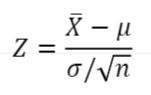
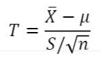
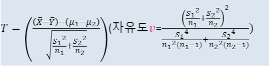
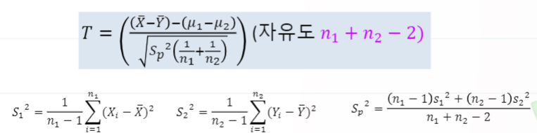
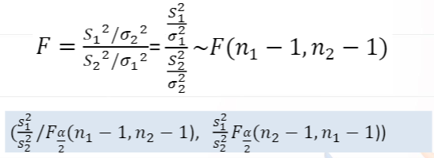
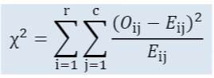
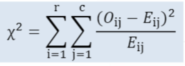

# 5. 기초통계분석과 R실습

# 5-3. 신뢰구간 추정의 이해

## 가설검정의 이해

- 가설검정이란, 모집단의 모수나 모집단의 분포에 대하여 어떤 주장을 설정하고, 적절한 통계량을 이용하여 그 주장을 기각할 것인지 또는 채택할 것인지를 판단하는 과정

- 가설이란 모수나 모집단의 분포에 대해 서술된 통계적 가설(statistical hypothesis)을 의미

- 귀무가설과 대립가설

  - 대립가설(H1으로 표기) : 연구자가 주장하고 싶은 확인되지 않은 가설 혹은 연구가설이라 하고 주로 부등호를 이용하여 표현 (Alternative Hypothesis)
  - 귀무가설(H0으로 표기) : 연구자의 주장에 상반되는 가설로서 연구자의 주장이 받아들여지기 전까지 참(true)으로 받아들여지는 가설 (Null hypothesis)
  - 단측대립가설 : 대립가설에 나타나는 영역이 한쪽인 가설(One side)
  - 양측대립가설 : 대립가설에 나타나는 영역이 양쪽인 가설(Two side)

- 가설검정 결과의 표현

  - 랜덤표본을 통하여 주어진 가설을 옳지 않다고 판단할 때 그 가설을 기각(reject)한다고 하며 그 가설이 옳다고 판단할 때 그 가설을 채택(accept)한다고 함
  - 통계적 가설검정의 결과는 귀무가설을 중심으로 표현하며 또 기각할 수 있는지, 없는지와 같이 기각을 중심으로 표현
  - 귀무가설은 되도록이며 가장 간단한 형태로 표현

- 가설검정에서 수반되는 두 가지 오류

  - 제1종 오류(type 1 error) : 귀무가설이 참일 때 귀무가설을 기각하는 오류(확률)
  - 제2종 오류(type 2 error) : 귀무가설이 거짓일 때 귀무가설을 채택하는 오류

  |          |    구분     | 실제상황  | 실제상황  |
  | :------: | :---------: | :-------: | :-------: |
  |          |             |  H0 : 참  |  H1 : 참  |
  | 검정결과 | H0 기각안함 | 옳은 결정 | 2종 오류  |
  | 검정결과 |   H0 기각   | 1종 오류  | 옳은 결정 |

- 판단기준

  - 랜덤표본에 근거하여 귀무가설을 기각하지 못하는 경우와 대립가설이 보다 타당하다고 판단되어 귀묵가설을 기각하는 경우 중 하나를 결정하는 기준

- 유의수준(significance level) α

  - 제 1종오류가 발생할 확률의 최대허용치

  - 제  2종 오류의 확률을 β로 표기

  - 제 1종 오류와 제 2종 오류 사이의 관계

    - 제 1종 오류를 줄이면 2종 오류가 늘어남

  - 통계적 가설검정에 있어서는 제1종 오류가 발생할 확률의 허용한계인 α를 고려하여 검정

  - 귀무가설이 사실이 아닐 때 귀무가설을 기각하게 될 확률은 1-β로서 이 값을 검정력(power)이라고 부름

    -> power가 높을수록 가설검정을 더 정확하게 수행한다고 볼 수 있음.

- p값 (가설검정 전체의 결과를 하나의 값으로 요약해놓은 중요한 값, 얻은 샘플과 같이 나올 가능성, 확률)

  - 귀무가설이 참일 때 표본과 같이 나올 확률

  - p값이 작을수록 귀무가설에 반대되는 강한 증거를 나타냄

  - 가설검정에서 기각 혹은 채택을 결정하기 위한 판정에 가장 많이 사용되는 측도

  - p값을 유의확률이라고도 함. p-value라고도 부름.

  - 표본을 근거로 귀무가설을 기각할 수 있는 가장 작은 유의수준

    - p값 < 유의수준 α -> 유의수준 α에서 H0 기각

  - d p q을 활용한 확률계산이 필요(신뢰구간 추정과 가설검정에 모두 필요)

  - dnorm : 정규분포의 density값을 계산

    qnorm 

    pnorm : 해당되는 주어진 X까지의 누적확률을 나타냄. 원하는 확률을 줄 때 확률에 해당되는 X값을 구해주는 함수.

    dt, pt, qt : t분포의 경우 d p q와 같이 dt, pt, qt를 이용해서 셈할 수 있음.

    

## 모평균의 검정

- 모평균의 검정

  - 평균이  μ, 분산이 σ^2인 모집단으로보트의 랜덤표본 X1,X2, ..., Xn을 얻을 때 표본의 크기 n이 크면, 표본평균  x̄는 근사적으로 평균이  μ, 분산이 σ^2/n인 정규분포를 따른다.

    

  - 평균이  μ, 분산이 σ^2인 정규모집단으로보트의 랜덤표본 X1,X2, ..., Xn을 얻을 때 표본의 크기 n이 작고(30 이하) 모분산 σ^2이 알려져 있지 않은 경우에 모평균의 검정은 표본본산 S^2을 추정하여 사용하는 통계량 가 자유도 n-1인 t분포를 따른다는 사실을 이용하여 검정한다

- 모평균의 신뢰구간 검정

  - 모분산을 아는 경우 정규분포를 이용
    1. H0 : μ=μ0와 H1 : μ<=μ일 때, Z <= -Zα이면 귀무가설 기각 Zα
    2. H0 : μ=μ0와 H1 : μ>=μ일 때, Z >= Zα이면 귀무가설 기각
    3. H0 : μ=μ0와 H1 : μ!=μ일 때, |Z| >= -Z(α/2)이면 귀무가설 기각
  - 모분산을 모르는 경우 T분포를 이용(n이 30보다 작은 경우) 
    1. H0 : μ=μ0와 H1 : μ<=μ0일 때, T <= -t(an-1)이면 귀무가설 기각
    2. H0 : μ=μ0와 H1 : μ>=μ0일 때, T >= -t(an-1)이면 귀무가설 기각
    3. H0 : μ=μ0와 H1 : μ!=μ0일 때, |T| >= -t((a/2)n-1)이면 귀무가설 기각
  - t분포는 정규분포보다 훨씬 꼬리 두껍기에 같은 정규분포보다 기각역의 값이 달라짐

## 모평균의 동일성 검정

- 두 독립표본의 모평균의 차에 대한 검정(분산을 모르고 두 분산이 동일하지 않은 경우)

  - 두 모평균의 차 μ1-μ2에 대한 검정통계량

  

- 두 독립표본의 모평균의 차에 대한 검정(분산을 모르고 두 분산이 동일한 경우)

  - 두 모평균의 차 μ1-μ2에 대한 검정통계량

  

## 모분산의 동일성 검정

- 모분산의 비에 대한 검정

  - 두 모분산의 비 (σ1^2)/(σ2^2)에 대한 검정통계량

    

    - 이와 같은 quantity는 이와 같은 통계량은, 자유도가 n1-1, n2-1 두 개인 F 분포를 따름
    - F분포를 이용하는 F분포 자유도 두 개에 해당되는 F분포의 좌우측값을 이용해서 신뢰구간 구함
    - F분포의 특징상 F(1-α)와 Fα의 관계를 자유도를 바꾸면 되는 관계의 역수에 있기 때문에 지금 신뢰구간을 종합적으로 정리하면 이와 같은 신뢰구간을 얻을 수 있게 됨
    - 이 신뢰구간에 근거해서 이 안에 있으면 신뢰구간 안에 모분산의 비가 있으면 동일하다고 볼 수 있고  신뢰구간 바깥에 있으면 가설검정으로 우리가 귀무가설을 기각할 수 있게 됨.

## 가설검정의 이해

- 자주 사용되는 기각값(정규분포의 경우)

  | 유의수준 | 단측검정(오른쪽) | 양측검정() |
  | :------: | :--------------: | :--------: |
  |   0.10   |      1.282       |   1.645    |
  |   0.05   |      1.645       |   1.960    |
  |   0.01   |      2.326       |   2.576    |

  - T분포의 경우 기각값은 자유도에 따라 달라지며 표본의 수가 작은 경우

    같은 유의수준에 대하여 기각값은 정규분포의 기각값보다 항상 큰 값을 가지지만 표본의 수가 커질수록 정규분포의 기각값으로 수렴하게 됨

  - ex. 유의 수준을 5%에서 단측할 경우 1.645보다 오른쪽에 있으면 5%

    ​	양측을 사용할 때는 2.5%가 돼야하기에 값은 1.96보다 크면 0.025rk ehla.

## 교차분석의 이해

- 교차분석

  - 분할표 검정(contingency table test) 또는 카이제곱 적합도 검정(Chi-square Godoness of fit test)으로 부름
  - r*c 분할표를 이용하여 모집단들의 분포가 동일한지를 검정하는 방법
  - 카이제곱 분포에 기초한 통계적 방법으로, 관찰된 도수가기대되는 도수와 의미있게 다른지의 여부를 검정하기 위해 사용되는 방법
  - 자료가 도수(frequency)로 주어졌을 때 사용가능 하며 특히 명목척도 자료의 분석에 유용

- 동일선 검정(Homoeneity of distributions)

  |   구분   | 범주1 | 범주2 | ...  | 범주 c |
  | :------: | :---: | :---: | :--: | :----: |
  | 모집단1  |  O11  |  O12  | ...  |  O1c   |
  | 모집단2  |  O21  |  O22  | ...  |  O2c   |
  |   ...    |  ...  |  ...  | ...  |  ...   |
  | 모집단 r |  Or1  |  Or2  | ...  |  Orc   |

- 검정통계량

  

  - 검정통계량의 분포 : 자유도(r-1)*(c-1)인 카이제곱분포

    Eij : 기대도수, Oij : 관찰도수

  - 귀무가설

    H0 : p1j = p2j = ... = prj(j = 1, ..., c)

    H1 : H0가 아님

  - 귀무가설이 사실일 때 각 셀에 대해서 기대도수를 서로 계산할 수 있기에 이 관찰도수와 기대도수의 차의 제곱을 관찰도수로 나눈 모든 셀에 대해서 이 작업을 했을 때 나타나는 합계치를 카이제곱 값으로 생각할 수 있음.

  - 카이제곱의 값은 자유도가 r-1과 c-1의 곱인 카이제곱 분포를 따른다는 사실을 알게 되기 때문에 이 분포에 해당되는 값과 샘플에서의 이 카이제곱 값을 비교해서 가설을 검정할 수 있게 됨.

  - 귀무가설은 같다는 것. 이런 모집단들의 각 범주에서의 확률분포가 동일하다는 것이므로 대립가설은 하나라도 다름.

  - 예 : 어떤 정치적 이슈에 대하여 여론조사를 한 결과 다음과 같은 결과가 나타났다. 25세 미만 집단과 25세 이상 집단의 성향이 다른지를 판단하고자 한다.

    |   구분    | 반대 | 미결정 | 찬성 | 합계 |
    | :-------: | :--: | :----: | :--: | :--: |
    | 25세 미만 | 400  |  100   | 500  | 1000 |
    | 25세 이상 | 600  |  400   | 500  | 1500 |
    |   합계    | 1000 |  500   | 1000 | 2500 |

    - **카이제곱통계량 = 125** 
    - **귀무가설 기각**
    - 어떤 정치적 이슈에 대해서 조사를 한 결과가 25세 미만 그룹의 population과 25세 이상의 population에 대해서 반대하거나 결정을 못했거나 찬성한 이러한 각각의 probability가 같다고 볼 수 있는가 하는 문제.
    - 카이제곱 통계량을 계산해 보면 125고 카이제곱 분포에서의 행의 수-1 하면 2-1하면 1
    - 열의 수가 3이기 때문에 –1을 하면 1이고 2x1의 자유도를 가지는 카이제곱 분포에 해당되는 값과 비교해 보면 이 카이제곱 통계량의 값이 훨씬 커서 이 귀무가설을 기각할 수 있게 됨.
    - 즉, 25세 미만과 25세 이상의 어떤 정치적 이슈에 대한 이 카테고리별 probability가 같이 않다는 결론을 내릴 수 있음.

## 독립성 검정

- 독립성 검정 (변수 A : r개 범주, 변수B : c개 범주)

  |  구분  | 범주1 | 범주2 | ...  | 범주 c |
  | :----: | :---: | :---: | :--: | :----: |
  | 범주 1 |  O11  |  O12  | ...  |  O1c   |
  | 범주 2 |  O21  |  O22  | ...  |  O2C   |
  |  ...   |  ...  |  ...  | ...  |  ...   |
  | 범주 r |  Or1  |  Or2  | ...  |  Orc   |

- 검정통계량

  

  - 검정통계량의 분포 : 자유도 (r-1)*(c-1)인 카이제곱분포

    Eij : 기대도수, Oij : 관찰도수

  - 귀무가설

    H0 : pij = pi * pj (범주간 독립)

    H1 : H0가 아님 (범주간 종속)

  - 예 : 어떤 정치적 이슈에 대하여 여론 조사를 한 결과 다음과 같은 결과가 나타났다. 성별과 의사결정은 독립인지 판단하고자 한다.

    | 구분 | 반대 | 미결정 | 찬성 |
    | :--: | :--: | :----: | :--: |
    | 남자 | 475  |  243   | 1154 |
    | 여자 | 442  |  362   | 1083 |

    - 카이제곱통계량 = 26.788
    - 귀무가설 기각(p값 = 1.524e-06)
    - 성별이라는 카테고리와 의사결정이라는 카테고리. 성별과 의사결정이 서로 독립인가? 어떤 독립적인 관계에 있는가? 그렇지 않은가?
    - 카이제곱 통계량을 계산해 보면, (샘플에서 계산) 26.79정도 얻어짐.
    - 카이제곱 분포표 상의 값은 이 값보다는 작기에 귀무가설을 쉽게 기각할 수 있음.
    - 이때 주어지는 p값은 아주 작으므로 귀무가설을 기각하는 강한 반증이 이 데이터에서 나타난다고 설명할 수 있음.