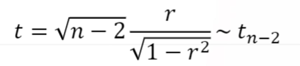

# 6. 빅데이터회귀분석과 R실습

# 6-1. 회귀분석과 상관분석의 기초개념

## 상관분석과 회귀분석

- 상관분석
  - 변수와 변수 사이의 관계 파악
  - ex. 지능지수와 학업성적, 흡연량과 폐암발생율 등
- 회귀분석
  - 변수와 변수 사이의 관계식 추론
  - ex. 풍차 속도와 발전량, 사용 년 수에 따른 트랙터 유지비

## 용어이해

- 독립변수(independent variable) 혹은 설명변수(explanatory variable)
  - 풍차속도, 사용년수 등과 같이 영향을 주는 변수
- 종속변수(dependent variable) 혹은 반응변수(response variable)
  - 발전량, 유지비 등과 같이 영향을 받는 변수
- 산점도(scatter plot)
  - 두 변수의 자료들을 좌표평면 위의 점들로 나타낸 그림

## 상관분석

- 상관분석(Correlation analysis)
  - ex. 어느 고등학교에서 랜덤하게 선택된 10명 학생의 수학, 물리, 음악 자료 산점도
- Francis Galton : 영국의 수학자, 생물학자. 아버지와 아들의 키에 대한 조사에서 두 변수의 관계를 수량적으로 나타내는 통계량을 고안
- Karl Pearson : 영국의 통계학자. 두 변수 사이의 수량적 관게를 더욱 발전되어 표본상관계수로 정착

- 표본상관계수

  

- 표본상관계수의 특징

  - 항상 -1 <= r <= 1을 만족
  - 표본상관계수의 값이 -1이나 1에 가까울수록 산점도에서 점들이 어떤 직선 주위에 밀집되어 나타나고 이는 두 변수 사이의 직선관게가 강함을 뜻함.

- 성적자료의 표본상관계수

  - 수학과 물리의 표본상관계수 0.9918
  - 수학과 음악의 표본상관계수 0.1551

- 상관계수의 검정

  1. 귀무가설 : H0:p = 0과 대립가설 H1:p>0

  2. 귀무가설 : H0:p=0와 verseus H1:p<0

  3. 귀무가설 : H0:p=0와 verseus H1:p != 0

     에 대하여

     

     ​	

  자유도 n-2인 t분포를 따름을 이용하여 가설검정 (데이터들이 이변량 정규분포를 따른다는 가정이 전제)

  이런 양측 대립가설의 경우, 자유도 (n-2)인 t분포인 좌측, 우측 값보다 α/2 값을 만족하는 D 분포표 상에서의 값을 이용해서 이 값보다 더 작으면 귀무가설을 기각

## 회귀분석

- 회귀분석(regression analysis)

  - 회귀분석이란 한 변수에 대한 다른 변수의 변화를 예측하려고 할 때 그 관계를 함수관계로 나타내어 분석하는 것.

- 회귀분석의 주요 목적

  - 변수들 사이에 성립하는

  1. 회귀모형의 설계
  2. 관련된 모수의 추정
  3. 예측(Prediction)

- 두 변수 사이의 관계 (수학적 함수관계와 통계적 관계)

  - 수학적 함수관계
    - 변수들 간의 오차가 존재하지 않는 정확한 수학적 함수관계, 즉 X의 값이 정해지면 그 ㄱ밧에 의해 Y의 값이 유일하게 결정되는 관계(두 변수의 함수적 관계)
    - ex. 아인슈타인의 공식(E=mc^2)
  - 통계적 관계
    - 변수들 간에 오차를 허용하는 관계, 즉 X의 값이 정해지더라도 Y의 값이 정확하게 결정 되어지지 않는 경우 그 차이를 오차라 하고 이런 관계를 통계적 관계라 함
    - ex.  아들의 키(y)와 아버지의 키(x)의 관계(y= β0 +  β1x +ε)

- 회귀분석의 예

  - 전동기의 임대비용(y)은 기본비용이 $1.5이고 시간당 $2.0일 때 시간(x)과 임대비용 사이의 관계식은?
  - 가족의 식비(y)와 수입(x)에 관한 관련성을 조사할 경우 수입이 같더라도, 가족의 규모나 습관, 생활양식에 따라 식비 지출이 다를 수 있다. 식비와 수입의 관계식은?

## QUIZ

1. 분산분석 : 데이터 전체의 변동을 처리에 의한 변동과 오차에 의한 변동으로 분해하여 처리효과의 동일성을 검정하는 방법
2. 군집분석 : 여러개체들을 서로 가까운 것 끼리 묶어 전체 개체들을 몇 개의 그룹으로 분류하는 통계적 방법