# 6. 빅데이터회귀분석과 R실습

# 6-2. 다중 선형 회귀분석과 다중 회귀분석의 통계학적 이해

## 단순선형 모형 및 추론

- 단순(simple)

  - 반응변수와 설명변수가 각각 한 개의 변수만을 고려할 때 단순회기라 함.

- 선형(Linear)

  - 회계계수 β0, β1에 대하여 회귀모형이 직선으로 표현될 경우 선형모형이라 함.

- 단순선형 회귀모형

  - 반응변수 y와 설명변수 x 사이에 다음과 같은 선형관계가 있다고 가정하는 모형
  - y = β0 + β1x + ε (1)
  - 위 모형은 변수 y를 변수 x에 대한 일차식으로 설명하려는 회귀모형
  - 여기에서 β0 와 β1은 회귀계수(regression coefficient) 또는 모수(parameter)라 부름
  - ε은 기대값 0, 분산 σ^2을 갖는 오차 확률변수

- 단순선형 회귀모형

  - 두 변수(x,y)에 대한 n개의 자료가 (x1,y1),(x2,y2),...,(xn,yn)으로 주어질 때 회귀모형은 구체적으로 
  - yi = β0 + β1x1i + εi (2) 로 표현됨
  - 이때 오차확률변수는 등분산성, 독립성, 정규성의 가정이 필요
  - 즉, Var(εi) = σ^2, Cov(εi, εj) = 0(i != j), εj n(0,σ^2)

- 회귀모수 추정

  - 단순선형 회귀모형에서 미지의 직선관계를 나타내는 y = β0 + β1x를 모회귀직선(population regression line)이라 부름
  - 모회귀직선을 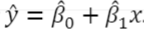로 추정할 때 오차제곱합 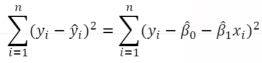(3) 을 최소로 하는 최소제곱법(least squares method)이라 함

- 회귀모수의 최소제곱추정량

  - 최소제곱추정량은 (3)을 회귀계수들에 대하여 편미분하여 얻을 수 있으며 그 결과는 다음과 같음
  - 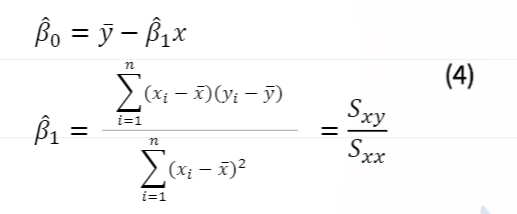
  - 이들을 이용하여 추정된 회귀직선을 얻을 수 있음.

- 총 제곱합의 분해와 결정계수

  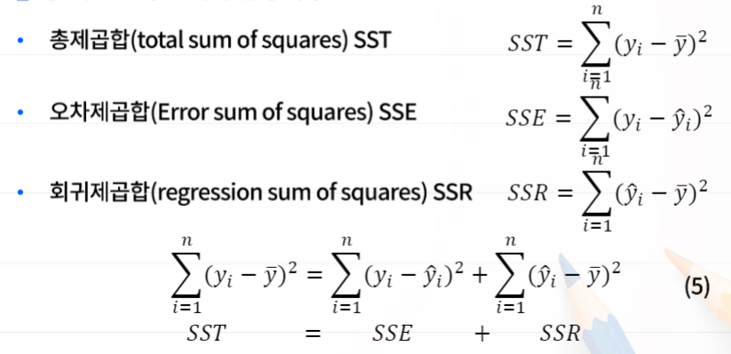

- 총 제곱합의 분해와 결정계수
  - 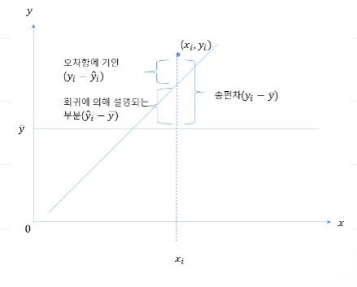
  - [해설] 자료 전체의 흩어짐을 오차항에 의한 부분 SSE와 회귀모형에 의해 설명되어지는 부분인 SSR로 나눌 수 있음을 의미. 따라서 총 제곱합 SST에 비하여 오차제곱합 SSE가 작으면, 즉 SST에서 SSR이 차지하는 부분이 크면, 회귀모형이 관측결과를 잘설명해주는 것임.

- 결정계수(coefficient of determination)

  - 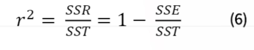
  - 결정계수의 값은 항상 0과 1 사이의 수이고 결정계수는 표본상관계수의 제곱이 됨
  - 결정계수의 값이 1에 가까울수록 산점도에서 점들이 직선 주위에 밀집되어 나타남을 뜻하고 이느 ㄴ회귀모형에 의한 설명이 잘 되는 것을 뜻함.

- 단순선형 회귀분석 분산분석표(Analysis of Variance Table)

  - 총 제곱합을 회귀모형에 의한 제곱합과 오차제곱합으로 분해하여 분산분석표로 정리

  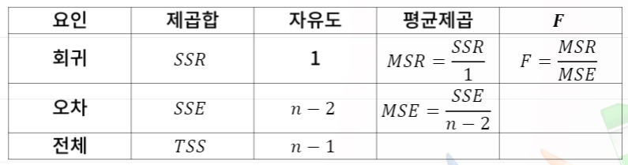

  - 여기서 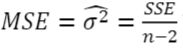임.
  - 회귀모형의 유의성을 자유도가 각각 1과 n-2인 F분포의값과 비교하여 가설검정 수행.
  - F = MSR/MSE값이 F1,n-2(α)값보다 크면 회귀모형이 타당하다고 결론

- 회귀계수에 대한 검정 - 기울기

  - 모 회귀직선의 기울기에 대한 가설 검정
  - 기울기의 값이 특정한 값 β10이라는 가설 검정
  - H0: β1 = β10
  - H1: β1 != β10
  - 검정통계량 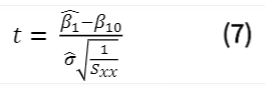이 귀무가설 하에 자유도가 n-2인 t분포를 따른다는 사실을 이용하여 가설검정
  - |t| >= t(n-2)*(α/2)이면 H0를 기각

- 회귀계수에 대한 검정 - 절편

  - 모 회귀직선의 절편에 대한 가설 검정
  - 절편의 값이 특정한 값  β00이라는 가설 검정
  - H0: β0 = β00
  - H1: β0 != β00
  - 검정통계량 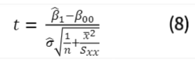가 귀무가설 하에서 자유도가 n-2인 T분포를 따른다는 사실을 이용하여 가설검정
  - |t| >= t(n-2)*(α/2)이면 H0를 기각

- 회귀계수에 대한 신뢰구간 추정

  - 회귀계수에 대한 100*(1-α)% 신뢰구간 추정
  - 회귀직선의 기울기 β1에 대한 100*(1-α)% 신뢰구간 추정
  - 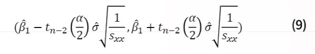
  - 회귀직선의 기울기 β1에 대한 100*(1-α)% 신뢰구간 추정
  - 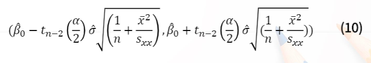

## 다중 선형 회귀모형

- 다중 선형 회귀모형

  - 반응변수 y와 여러 개의 설명변수 x1, x2, ..., xp 사이에 다음과 같은 선형관계가 있다고 가정하는 모형
  - 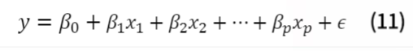
  - 위 모형은 변수 y를 여러 개의 설명변수들에 대한 선형식으로 설명하려는 회귀모형
  - 여기에서 β0,β1,...,βp는 회귀계수(regression coefficient)임
  - ε은 기대값 0, 분산σ^2을 갖는 오차 확률변수

- 다중 선형 회귀모형

  - 여러 개의 독립변수 (x1, x2, ..., xp)와 설명변수 y에 대한 n개의 자료가 (x11, x21, ..., xp1,y1)(x12, x22, ..., xp2,y2), ... , (x1n, x2n, ..., xpn,yn)으로 주어질 때 회귀모형은 구체적으로  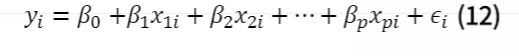로 표현됨.
  - 이때 오차확률변수는 등분산성, 독립성, 정규성의 가정이 필요.
  - 즉, 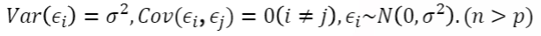

  

- 행렬을 이용하여 표현

  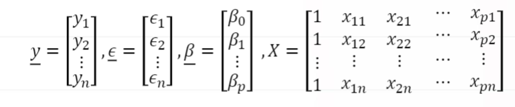

- 모형

  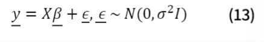

- 최소제곱법

  - 오차제곱합을 최소로 하는 회귀계수를 추정하는 최소제곱추정량의 유도

  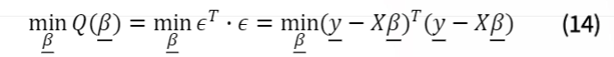

  - (13)식을 β에 대하여 편미분하고 이를 정리하면, 다음과 같은 정규방정식(Normal equation)을 얻음.

  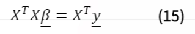

  -  X^T X의 역행렬이 존재하면, 양번에 역행렬 (X^T)^(-1)를 곱하여 회귀계수 벡터의 최소제곱추정량을 다음과 같이 구할 수 있음

  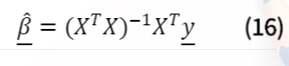

  - 다중 회귀분석 분산분석표(ANOVA table)

    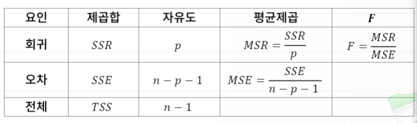

    - 참고사항

    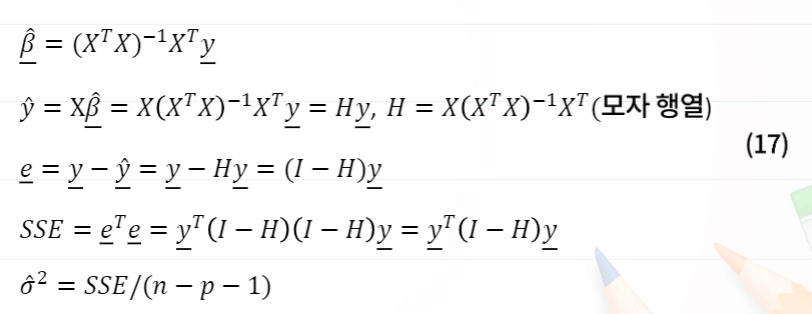

  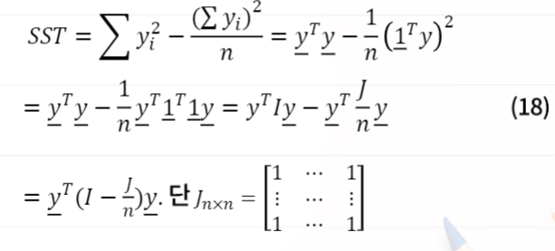

  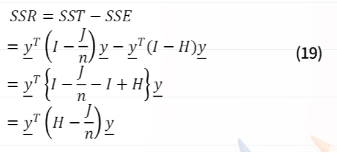

  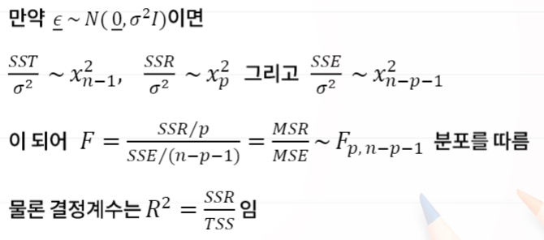

- 최소제곱추정량의 성질

  - 가우스-마코프(Gauss-Markov)정리

    다중선형회귀모형의 오차벡터에 대해 평균이 0이고 서로 독립이며 등분산인 경우, 회귀계수에 대한 최적 선형불편추정량(BLUE : best linear unbiased estimator)은 최소제곱추정량임.

    - 참고사항

    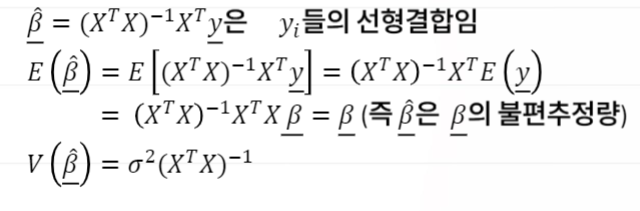

- 회귀계수에 대한 검정 (Hoj : βj = 0 : H1j : βj != 0, 단, j = 1, 2, ..., p)

  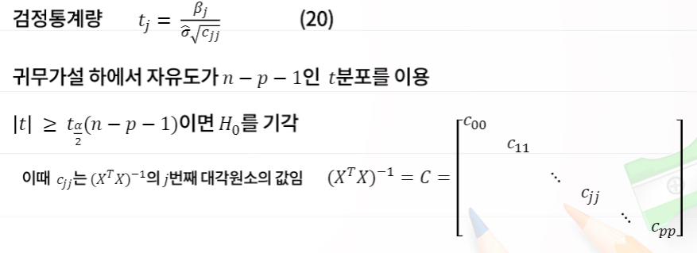

- 회귀계수에 대한 신뢰구간 추정

  - 회귀계수에 대한 100*(1-α)% 신뢰구간 추정

  - 휘귀계수 βj에 대한 100*(1-α)% 신뢰구간 

    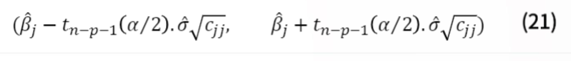

    여기서 cjj는 (X^TX)^(-1)의 j번째 대각원소 값임
