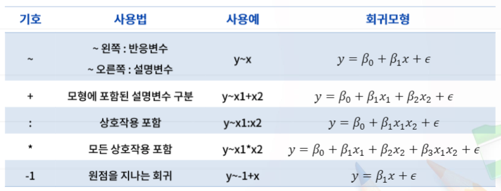

# 6. 빅데이터회귀분석과 R실습

# 6-3. 단순 선형 회귀분석과 다중 회귀분석 R실습

## 단순선형회귀분석 R실습

| 함수이름  |           용도            |           사용규칙            |
| :-------: | :-----------------------: | :---------------------------: |
|   lm()    |     선형회귀분석 수행     |            lm(y~x)            |
| summary() | 회귀분석 관련 통계량 출력 |    회귀계수 추정, 검정 등     |
| predict() |        예측값 제공        | 설명변수값에 대한 예측값 제공 |

- lm() 함수로 생성된 객체 fit은 많은 정보를 가지고 있음.
  - fit 객체에 있는 정보를 획득하기 위해 적용시킬 수 있는 함수
    - anova() : 분산분석표 제공
    - coefficient() : 추정된 회귀계수 제공
    - confint() : 회귀계수의 신뢰구간 제공
    - fitted() : 반응변수의 적합값 제공
    - residuals() : 회귀모형의 잔차 제공
    - summary() : 회귀모형의 다양한 적합결과 제공

## 다중 선형 회귀분석 R 실습

- 회귀모형의 적합
  - lm(모형식, data, subset, weights, ...) 함수 사용
    - 모형식 : 회귀모형식
    - data : 사용할 데이터가 있는 데이터프레임
    - subsets : 데이터의 일부분만을 사용할 경우
    - weight : 관찰값에 가중치를 사용할 경우
- 회귀모형의 예
  - lm(y~x1+x2) : y = β0 + β1x + ε

- R에서의 회귀모형 표현

  

## QUIZ

Q1. R 에서 단순 선형회귀분석 lm(y ~ x)을 수행한 결과를 객체 fit으로 생성시켰을 때 오차분산의 추정치를 얻기 위한 명령은?

A. summary(fit)

R 에서 summary(fit) 함수는 객체 fit에 포함되어있는 많은 정보 중에서 회귀계수의 추정값, 잔차분포 요약 그리고 오차의 표준편차(√MSE), 결정계수 등 여러 가지 정보를 제공해 준다. 

- confint(fit) : 회귀계수에 대한 95% 신뢰구간 추정값을 제공
- residual(fit) : 회귀모형 적합 후의 잔차값들을 제공