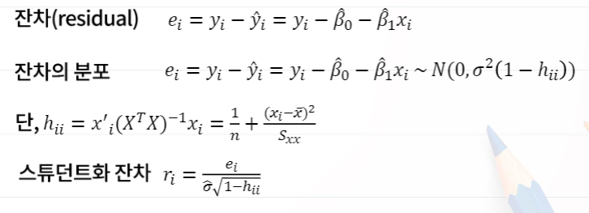
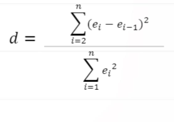
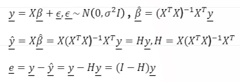
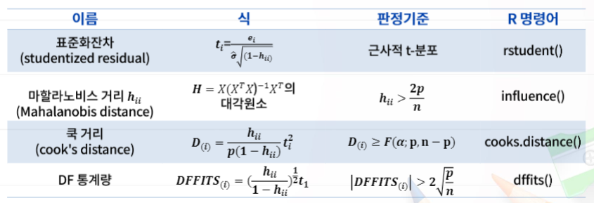

# 6. 빅데이터회귀분석과 R실습

# 6-4. 회귀 진단과 R실습

## 회귀진단

- 회귀모형을 추정한 후에는 모형과 가정에 대한 점검이 필요
- 회귀진단 통계량을 이용
- 회귀모형이 데이터를 얼마나 잘 설명하는가에 대한 점검
- 각 관찰치의 효과에 대해 점검
- 잔차를 이용한 통계량 사용
- 잔차들이 모형의 가정을 따르지 않는 경우 새로운 모형을 모색

## 잔차분석

- 모형에서 오차항에 대한 주된가정

  1. E(εi) = 0   =>오차들의 평균
  2. V(εi) = σ^2(등분산성)   =>오차들의 분산
  3. εi의 독립성  => 오차들이 서로 독립
  4. εi의 정규성  => 오차들이 정규분포를 따른다

  위 과정들은 R^2, t, F, ... 등과 같은 통계량을 통해서 조사할 수 없으므로 잔차분석을 통하여 검토

## 단순 선형 회귀분석의 경우

- 잔차 산점도
  - 회귀모형이 타당한 경우 설명변수에 대한 잔차산점도나 반응변수에 대한 잔차산점도를 통하여 잔차들이 0을 중심으로 랜덤하게 나타나면 회귀모형이 타당하다고 결론.
  - 

## 오차항의 등분산성과 독립성

- 오차의 등분산성이 성립된 경우 잔차를 x에 대하여, 또 y에 대하여 산점도를 그렸을 때 0을 중심으로 랜덤하게 나타나고 수평축에 따라 어떤 경향도 나타나지 않아야 함.

- 오차의 독립성은 Durbin-Watson 검정통계량 이용

  

## Durbin-Watson 검정

- 귀무가설 : H0 : ρ = 0 (두 변수간의 상관계수가 0이다)에 대해 H1 : ρ ≠ 0의 검정은 만약 d<dL 이면 귀무가설을 기각하고, d>dU 이면 귀무가설을 기각하지 못함. 만약 dL<d<dU이면 기각여부를 결정하지 못함. dL과 dU는 설명변수의 개수 p에 의존하는 값.
- R에서는  dwtest()함수를 이용하여 Durbin-Watson 검정을 할 수 있음.

## 오차의 정규성

- 오차항의 정규성을 점검하는 방법으로 잔차들의 분위수대 분위수 그림(Q-Q plot)을 통하여 판단
- 분위수 그림에서 데이터들이 45도 기울기의 직선 근처에 있으면 정규성을 크게 벗어나지 않는다고 할 수 있음.
- R에서는 qqnorm()과 qqline()함수를 이용하여 QQ-plot을 그릴 수 있음
- Shapiro-Wilks(1965) 검정도 정규성 검정에 이용될 수 있으며, R에서는 shapiro.test()함수를 이용하여 정규성 검정을 수행할 수 있음.

## 다중 선형 회귀분석의 경우

- 의 관계로부터
  - 잔차를 통한 회귀진단 문제는 행렬 H가 잔차벡터의 공분산행렬에 대한 정보를 담고 있는 사실 파악
  - 행렬 H(hat matrix, 모자행렬)를 활용하여 회귀진단 가능
  - H의 i번째 다각원소를 hii 지렛대(levargae)라고도 부름

- 다양한 회귀 진단 통계량들이 존재

- 대표적인 회귀진단 통계량(특이한 관찰값) 소개

  

## QUIZ

1. R함수
   - shapiro.test() 는 잔차의 정규성에 대한 검정을 수행하는 함수
   - plot() 함수는 잔차산점도를 그릴 때 사용되지만 시각적이고 주관적으로 판단할 뿐 어떤 통계적 결과도 제공하지X
   -  influence.measure() 함수는 영향력 있는 관찰값을 제공