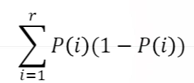
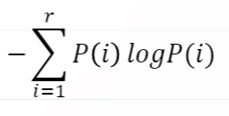
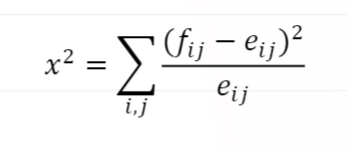
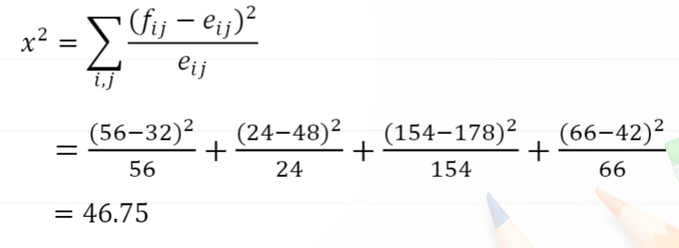
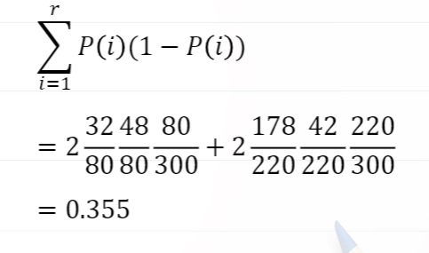
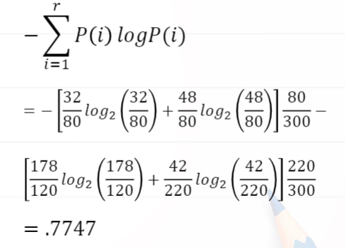
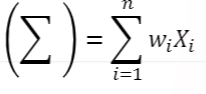
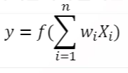

# 7. 빅데이터분류분석과 R실습

# 7-2. 분류분석의 통계학적 이해

## 분류분석

- 분류분석(Classification analysis)
  - 여러 개의 변수를 갖는 데이터 세트를 대상으로 특정변수의 값을 조건으로 지정하여 데이터를 분류하고 트리형태의 모형을 생성하는 분석 방법
  - 의사결정나무, 조건부 추론나무, 인공신경망, 랜덤포레스트, 역전파알고리즘 방법, 베이스분류 방법 등

- 분류분석 과정
  - 기존의 알려진 데이터를 수집하여 학습자료(training data)를 생성
  - 학습자료를 대상으로 분류알고리즘을 통해 예측모형을 생성
  - 검정 데이터(test data)를 이용하여 분류규칙의 정확성 평가(모형평가)
  - 모형평가 결과를 토대로 모형을 수정하거나 새로운 데이터에 모형을 적용하여 분류값 예측

## 의사결정 나무(Decision Tree)

- 특징

  - 지도학습기법
  - 각 변수의 영역을 반복적으로 분할함으로써 전체 영역에서의 규칙을 생성
  - 나무(Tree) 구조 형태로 분류 결과 도출
  - 입력 변수들 중 가장 영향력 있는 변수를 기준으로 이진 분류하고 결과를 나무구조형태로 시각화
  - 의사결정규칙을 도표화하여 분류와 예측을 수행하는 분석방법
  - 모형 생성이 쉽고 단순하며 명료한 결과를 제공
  - 가장 많이 사용되는 지도학습 모형

- 오차

  - 학습오차 : 학습자료로부터 구한 오차
  - 예측오차 : 미래의 자료로부터 구한 오차
  - 지도학습은 일반화에 관심 --> 학습오차보다 예측오차에 더 많은 관심을 둠
  - 지도학습의 목적은 예측오차를 최소화하는 모형의 구축

- 의사결정나무의 구성요소

  - 마디(node)
  - 뿌리마디(root node) : 시작되는 마디, 전체자료로 구성
  - 자식마디(child node) : 분리되어 나간 2개 이상의 마디
  - 끝 마디(terminal node) : 자식마디가 없는 마디

- 순수도와 불순도

  - 각 마디에서 분리변수와 분리기준은 목표변수의 분포를 가장 잘 구별하도록 정함

  - 목표변수의 분포를 얼마나 잘 구별하는가에 대한 측정치로 순수도(purity) 또는 불순도(impurity)를 사용

    ex. 그룹 0과 그룹1의 비율이 45%와 55%인 마디는 각 그룹의 비율이 90%와 10%인 마디에 비하여 순수도가 낮다 또는 불순도가 높다라고 함

  - 각 마디에서 분리변수와 분리 기준의 설정은 생성된 두 개의 자식마디의 순수도의 합이 가장 크도록 선택

- 불손도의 측도

  - 분류모형 - 지니지수, 엔트로피지수, 카이제곱통계량

- 지니지수(Gini index)

  

  - P(i)는 주어진 자료 중 i범주에 분류될 확률, r은 범주의 수를 나타냄

- 엔트로피 지수

  

- 카이제곱통계량

  

  ​	

- 불순도 계산 예(2x2 분할표의 경우)

  - 관찰도수가 아래와 같이 주어진 경우 불순도를 계산하시오.

  | 구분  | Good | Bad  | Total |
  | :---: | :--: | :--: | :---: |
  | Left  |  32  |  48  |  80   |
  | Right | 178  |  42  |  220  |
  | Total | 210  |  90  |  300  |

  (풀이)

  기대도수 계산

  | 구분  | Good | Bad  | Total |
  | :---: | :--: | :--: | :---: |
  | Left  |  56  |  24  |  80   |
  | Right | 156  |  66  |  220  |
  | Total | 210  |  90  |  300  |

  카이제곱통계량 계산

  

  지니지수 계산

  

  엔트로피 계산

  

- cart(classification and regression tree) 알고리즘
  - 가장 많이 사용되는 알고리즘
  - 1984년 L.Breiman 등에 의해 발표된 기계학습 방법
  - 학습자료로부터 입력변수에 근거한 새로운 관찰값 분류용나무구조를 생성
  - 입력변수의 관찰값에 따라 자료들을 두 그룹으로 분리, 이진분류를 생성
  - 목표변수가 범주형인 경우 지니지수를 불순도로 이용, 연속형인 경우 분산을 이용
  - 입력변수들의 선형결합 중 최적의 분리를 찾기도 함
  - R에서의 적용 :rpart패키지, rpart() 함수 사용

## 조건부 추론 나무

- cart 알고리즘의 제약

  - 통계적 유의성에 의한 판단없이 노드를 분할함에 따른 과적합(overfitting) 문제발생

  - 다양한 값으로 분할 가능한 변수가 다른 변수들에 비하여 선호되는 현상

  - 과적합 : 복잡한 모형을 사용하여 오차(학습오차)를 매우 작게 한 경우 예측오차가 커질 수 있는 현상(지도학습에 학습오차를 너무 작게 하는 것이 항상 좋은 것은 아님)

  - 이 두 문제를 해결한 새로운 방법 : 조건부 추론 나무

  - R에서의 적용 : party 패키지, ctree() 함수

    (ctree : conditional inference Trees)

## 인공신경망

- 인공신경망(Artificial neural network)이란

  - 인공신경망은 인간의 두뇌 신경들이 상호작용하여 경험과 학습을 통해서 패턴을 발견하고 이를 통해 특정사건을 일반화하거나 데이터를 분류하는데 이용되는 기계학습 방법
  - 컴퓨터가 스스로 인지하고 추론, 판단하여 사물을 구분하거나 특정상황의 미래를 예측하는데 이용할 수 있는 기계예측방법

- 신경망구조

  - 수상돌기로부터 외부신호를 입력받고 시냅스에 의해 신호의 세기를 결정한 후 세포핵으로 전달하면 신호와 세기를 토대로 신경자극을 판정하여 축삭돌기를 통해 다른 신경으로 전달

- 인공신경망

  - 외부 신호를 받는 수상돌기는 입력신호에 해당
  - 시냅스는 입력 신호에 가중치를 적용하는 역할
  - 세포핵은 입력신호(Xi)와 가중치(wi)를 이용하여 망의 총합을 출력신호를 보냄

- 망의 총합을 계산하는 수식

  - 망의 총합

    

  - 활성함수(f)는 망의 총합을 축색돌기에 출력신호(y)를 전송

  - 출력신호

    

- 가중치 적용

  - 시냅스의 역할
  - 입력값(X1, X2, .., Xn)은 외부신경 자극
  - 가중치(wi, w2, ..., wn)는 신호의 세기
  - 경계값(bias)은 활성함수에 의해 망의 총합을 다음 계층으로 넘길 때 영향을 주는 값

- 활성함수

  - 활성함수는 망의 총합과 경계값을 계산하여 출력신호를 결정함
  - 일반적으로 활성함수는 0과 1 사이의 값을 시그모이드(sigmoid) 함수를 이용
  - 계단함수는 0또는 1의 값으로 출력신호가 결정되므로 가중치와 경계값의 변화에 대해서 출력신호에 변화를 주지 못함

- 퍼셉트론(Perceptron)

  - 입력값 : X1, X2, ..., Xn
  - 입력층(input layer) : 입력값의 가중치(wi), 경계값(b)
  - 은닉층(hidden layer) : 입력층의 가중치(wi), 경계값(b)
  - 출력층(output layer) : 은닉층의 가중치(wi), 경계값(b)
  - 출력값 : o1, o2, ...

- 퍼셉트론 각 층의 구성요소

  - 퍼셉트론 모형에서 입력변수와 출력변수는 연구자 지정(지도학습)
  - 은닉층의 연산과정 비공개로 인한 블랙박스 모형으로 분류
  - 분류나 예측결과는 제공하지만 어떤 원인으로 결과가 도출되었는지 알 수 없음
  - R에서의 적용 : nnet 패키지, nnet()함수 사용

## 랜덤 포레스트

- 랜덤 포레스트(Random Forest)
  - 의사결정나무에서 파생된 모형
  - 앙상블 학습기법을 적용하는 모형
- 앙상블 학습기법(Ensemble)
  - 주어진 자료로부터 예측모형을 여러개 만들고 이것을 결합하여 최종적인 예측모형을 만드는 방법을 통칭(배깅(bagging) → 부스팅(boosting) → 랜덤포레스트 )
  - 배깅 : Boostrap aggregating의 준말, 부스트랩 자료생성 및 예측모형 작성 결합
  - 붓스트랩 자료 : 주어진 자료로부터 동일한 크기의 표본을 랜덤하게 복원 추출한 것
  - 부스팅 : 예측력이 약한 모형들을 결합하여 강한 예측모형을 만드는 방법
- 랜덤 포레스트
  - 2001년 Breiman에 의해 개발
  - 배깅이나 부스팅보다 더 많은 랜덤성을 부가하여 약한 학습모형을 만든 후 이들을 선형결합하여 최종모형을 개발
  - 기존의 방식들에 비해 많은 데이터를 이용하여 학습을 수행하기 때문에 예측력이 아주 높고 과적합 문제를 해결할 수 있음
- 학습데이터 구성방법
  - 붓스트랩 방식으로 학습데이터로 사용할 트리(Forest) 생성
  - 입력변수 중 일부 변수만 적용하여 트리의 자식 노드(child node)를 분류
  - R에서의 적용 : randomForest 패키지, randomForest() 함수 사용

## 역전파 알고리즘

- 역전파 알고리즘( back propagation algorithm)
  - 인공신경망에서 기계학습은 출력값(o1)과 관측값(y1)을 비교하여 오차(E)
  - E = y1 - o1를 계산하고 오차(E)를 줄이기 위해 가중치와 경계값을 조절
  - 오차가 0보다 큰 경우 출력값이 작다는 의미로서 출력값이 양수인 경우 가중치를 크게하고 출력값이 음수이면 가중치를 더 작게 조절하는 방법으로 알고리즘을 진행
  - 기본저긍로 퍼셉트론은 단방향 망으로 구성됨(입력층 → 은닉층 → 출력층으로 전파)
  - 이 방식을 개선하여 출력층 → 은닉층의 역방향으로 오차(E)를 전파하여 은닉츠으이 가중치와 경계값을 조정하여 분류정확도를 높이는 역전파 알고리즘을 도입
  - 역전파 알고리즘은 출력에서 생긴 오차를 신경망의 역방향으로 전파하여 순차적으로 편미분을 수행하면서 가중치와 경계값을 수정하여 입력값에 최적화된 가중치와 경계값이 적용되도록 구성된 알고리즘을 의미
  -  R에서의 적용 : neuralnet 패키지, neuralnet() 함수 이용