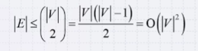

# 3. 비선형 자료구조

# 3-2. 그래프 자료구조

## Graphs

- 그래프 : 어떤 데이터 사이의 인접한 정보를 저장하는 자료구조

- 그래프에는 object와 relationship이 존재

  - object : 저장하고자 하는 객체

    ex. 어떤 사람이 될 수도 어던 도시가 될 수도...

  - relationship : 우리가 노드라 부르는 오브젝트가 그래프에 존재. 이들 사이의 관계성. -> 이들의 관계성을 그래프에 저장

    - 관계성이라고 하면 edge로 연결하는 것

      ex. SNS에서 친구들끼리 관계로 연결. 노드가 도시들이라고 하면 도시들사이의 인접한 도시들끼리를 엣지로 연결

    - 이런 object를 표현하는 노드를 vertex라고 표현하기도 하며 관계를 표현하는 엣지들을 arc나 link 등의 용어로 표현하기도 함

## Undirected Graphs

- 방향이 없는 그래프

  - 방향이 없는 그래프에는 N개의 vertex가 있다고 헀을 때, v1부터 vN까지의 N의 vertex가 있고 이들을 연결하는 edge가 순서가 없는 pair

  - {vi,vj} 이렇게 되어있으면 vi와 vj가 ㅇㄴ결되어 있음을 표현하는 엣지들로 이루어짐

  - 이런 연결성을 표현하기 위해서 adjacency matrix나 adjacency list를 쓸 수 있음

    ex. 9개의 vertex. 9개의 노드 v1부터 v9까지 있음. 엣지는 E = {{v1,v2},{v3,v5},{v4,v8},{v4,v9},{v6,v9}}끼리의 엣지 이렇게 5개의 엣지가 있음

    - 방향이 없는 undirecteed 그래프이기 때문에 {v1,v2}라고 하면 v1에서 v2로 가는 엣지, 그리고 v2에서 v1로 가는 엣지 모두 다 있다고 가정

  - 어떤 정의에서는 자기자신에서 자기자신으로 가는 엣지가 있다고 생각할 수도 있는데, 본 과정에서는 undirecte그래프에서 자기자신에서 자기자신으로 가는 엣지는 없다고 가정.

- V개의 vertex가 있는 undirected 그래프에서 최대한 많은 엣지의 개수는 아래 식으로 구할 수 있음.

  

  

## Degree

- vertex의 degree는 자신의 이웃개수로 정의
- neighbor, 이웃 : 어떤 점을 기준으로 연결되어 있는 ,adjacent, 이 중 하나의 엣지로 곧바로 갈 수 있는 노드 혹은 vertex의 집합

## Sub-Graph

- 서브그래프 : 오리지널 그래프가 있을 때, 오리지널 그래프에서 엣지와 vertex들을 추출했을 때 그 추출해낸 그래프
  - 서브그래프에 존재하는 모든 vertex와 모든 엣지들은 오리지널 그래프에 존재해야만 서브그래프라고 얘기할 수 있음

## Paths

- Undirected 그래프에서는 v0부터 vk 이렇게 노드의 시퀀스로 경로를 표현할 수 있고 이 시퀀스 내에서 인접한 두 개의 vertex 사이에는 반드시 엣지가 존재해야 함.
- 패스의 길이 : 몇개의 엣지를 거쳐갔는가. 즉, 몇개의 edge를 거쳐갔냐
- trival path : length가 0인, 자기자신에 머물러있는 것
- simple path : 경로상에 처음과 마지막을 제외헀을 때, 안에서 중복이 없는 경로
- simple cycle : simple path의 특수한 경우로 simple path이면서 처음과 마지막 vertex가 같은 경우

## Connectedness

- 연결성
- 두 개의 vertex vi와 vj가 연결되 어 있다, connected 되어 있다고 얘기하면 vi에서 vj로 path가 있으면 연결되어 있다고 이야기함
- 두 vertex가 connected, 연결되어 있다는 것은 둘 사이의 경로가 있냐 없냐를 얘기하는 것
- ex. 그래프가  connected다 -> 어떤 두 노드, 두 vertex를 집어도 그 사이에 경로가 있을 때
- 어떤 두 vertex사이에서 한 pair라도 경로가 존재하지 않는 pair가 존재하면 그 그래프는 connected되어있다고 얘기하지 않음

## Weighted Graphs

- 엣지가 단순히 연결성만을 표현하는 것이 아니라, 연결되어 있고 이들 사이에 어떤 숫자나 값을 부여한 것을 얘기함.

- 가장 많이 사용하는 엣지상의 숫자는 거리

- 방향이 없다고 하면 weighted undirected

- 그림을 그릴 때는 weighte값들은 엣지의 옆에 써주는 형태

- weighted 그래프에서의 경로의 길이, 경로를 따라 갔을 때 엣지 에 써있는 weight들의 합

  ex. shortest path : 두개의 vertes가 주어졌을 때 이런 weighted 그래프에서 path length가 최소화되는 경로 찾기

## Trees

- 트리의 경우에도 그래프의 한 종류
- 어떤 주어진 그래프가 트리가 되려면 그래프가 connected되어 있어야 하고 모든 vertex에서 모두 다른 vertex로 경로가 존재해야 하며 이 경로가 유니크해야함.
- 트리에서는 반드시 엣지의 개수가 노드의 개수보다 하나가 적음.
- 사이클 존재 X, 만약 주어진 트리에 아무데나 엣지를 추가하면 그 추가된 엣지 때문에 이 트리는 반드시 사이클이 생김
- 만약 하나의 엣지를 제거하게 되면 이 트리는 반드시 disconnected되게 되고 두개의 서로 다른 그래프로 나뉘며 두 개의 트리로 존재하게 됨

## Forests

- forest : 트리들의 집합
- vertex 개수가 edge 개수보다 항상 많음
- 트리의 개수를 구하고 싶으면 vertex 개수에서  edge개수를 빼면 트리의 개수 구할 수 있음, 포레스트 내에 존재하는 트리의 개수를 구할 수 있음
- 만약에 포레스트에서 하나의 엣지를 제거한다면 트리를 하나 더 만들게 되는 효과

## Directed Graphs

- directed 는 앞의 undirected 그래프와 다르게 엣지의 방향성이 존재하기 됨

- directed 그래프에서는 v1, v2로 엣지가 있다고 하면 v1에서 v2로 갈수는 있지만 반대는 경로가 존재하지 않는 엣지의 방향성 부여

- undirected 그래프에서의 degree가 neighbor의 개수로 정의됐다면 이 directed 그래프에서는 in_degree, out_degree가 분리되서 정의됨

  - in_degree : 나로 들어오는 엣지의 개수

    ex. v2가 v1, v4, v8에서 3개의 in-coming 엣지가 있다고 할 때 v2의 in_degree는 3이 되는 것

  - out_degree : 나로부터 출발하는 엣지의 개수

## Sources and Sinks

- source : in_degree가 0인 것. 나로 들어오는 것은 없고 나가기만 하는 소스
  - 소스의 정의 : in_degree가 0인 친구들을 소스 vertex

- sink : 싱크는 out_degree가 0이면 싱크라고 얘기
- undirected 그래프와 마찬가지로 directed 그래프에서도 패스를 똑같이 정의할수있는데 다른점은 예를들어 v1-v4이런식으로 패스가 있다고 했을 때. v1에서 v4로 반드시 방향성을 고려한 패스가 존재해야 한다는 것

## Connectedness

- connectedness는 directed 그래프로 오면서 크게 두가지로 나눠서 설명할 수 있음
  - 어떤 그래프가 strongly connected되어있다 : 모든 노드 pair간의 경로들에 있어서 방향성을 고려했을 때, 방향성을 인정했을 때.
  - weekly connected되어있다 : 방향성을 무시하고 연결성을 따졌을 때, 그래프가 연결되어 있다 하면.

## Weighted Directed Graphs

- weighted 그래프도 똑같이 directed 그래프에 edge에 weight를 부여하면, weighted directed가 됨

- directed acyclic 그래프, DAG 라고도 부름. DAG는 말그대로 방향이 있으나 사이클이 존재하지 않는 그래프
- 그래프의 edge에 direction이 있지만 사이클이 존재하지 않으면 그것은 directed acyclic 그래프라고 부르고 partial ordering. 뭔가 순서를 정할 때. 커리큘럼 순서를 정할 때 많이 사용되는 형태의 그래프

## Representations

- binary-relation list : edge들을 쭉 나열해놓은 것. 저장하기 위해서는 edge 개수 만큼의 메모리 필요
  - 두 vertex 사이가 연결되어있다 아니다를 체크하기 위해서 최대 엣지갯수만큼의 프로세싱 해야 함. vertex 하나로부터 neighbor를 구하고싶을때도 엣지들을 하나씩 체크해야 되기때문에, 굉장히 비효율적인 자료구조
- adjacency matrix : n차원 매트릭스를 놓고 True 써놓는 방법. 
  - 메모리를 가장 많이 쓰는 표현법
  - vertex 개수를 V라고 했을 때 V개곱개만큼의 메모리 사용
  - V개 만큼의 오퍼레이션을 요구할 때 vertex의 개수만큼을 봐야되는 computational overhead가 있음
  - adjacency matrix로 weighted 그래프를 표현하고 싶다고 하면. 저 각각의 cell에 True/False가 아니라 weight 값 자체를 입력
  - v1과 v2사이의 엣지가 있냐없냐. 저 점을 한번 access하면 되기 때문에 효율적
- adjacency list : 각 노드들을 기준으로 자신과 연결되어있는 엣지가 있는 vertex들을 리스트로 표현
  - 일반적인 알고리즘에서 가장 많이 사용하는 그래프
  - 자료구조가 요구하는 메모리 요구량은 전체 vertex갯수만큼의 linked list가 필요하고. 전체 데이터 개수를 따져보면. 엣지의 개수를 넘어가지 않음 -> 그래서 최대 vertex 혹은 엣지 개수만큼의 메모리를 요구

## 용어정리

1. 트리 (tree) : 계층적인 관계를 갖는 데이트들을 나타내는데 용이한 자료구조.
   - 최상단의 부모 노드를 갖지 않는 root 노드가 있으며, 최하단에서 자식 노드를 갖지 않는 root노드가 있으며 최하단에 자식노드를 갖지 않는 leaf노드가 있음.
2. 트리의 특징
   - 트리에서 어떤 노드의 자녀의 수를 degree라고 함. 자녀들의 순서 유무에 따라 ordered/unordered 트리로 분류.
3. 그래프(graph)
   - 데이터 사이의 인접한 정보를 저장하는데 용이한 자료구조
   - edge의 방향성 유무에 따라 directed/undirected 그래프로 분류
4. 그래프의 표현법
   - 그래프를 표현하는 방법에는 binary-relation list, adjacency matrix, adjacency list 3가지 방법이 존재
   - 일반적으로 adjacency lsit가 주로 사용

